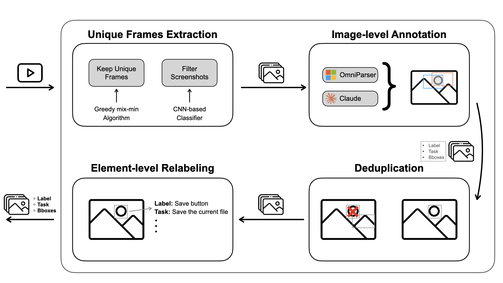

# GUI Agent Data Annotation Pipeline

## Project Overview

This project implements an automated data annotation pipeline for training GUI agents to interact with graphical user interfaces. The pipeline processes videos of GUI interactions and generates high-quality annotated datasets with labeled UI elements, tasks, and bounding boxes.

The annotation pipeline leverages both computer vision and language models to extract, filter, and annotate GUI elements from video frames, enabling the creation of comprehensive training datasets for GUI automation and interaction tasks.

## Pipeline Overview

The pipeline consists of four main stages:

1. **Unique Frames Extraction**: Extracts frames from videos and identifies unique frames using greedy mix-min algorithm and screenshot filtering via CNN-based classifier
2. **Image-level Annotation**: Annotates extracted frames using OmniParser and Claude to identify UI elements and their properties
3. **Deduplication**: Removes duplicate elements across frames while preserving unique annotations
4. **Element-level Relabeling**: Refines and validates element labels, tasks, and bounding boxes for training data quality